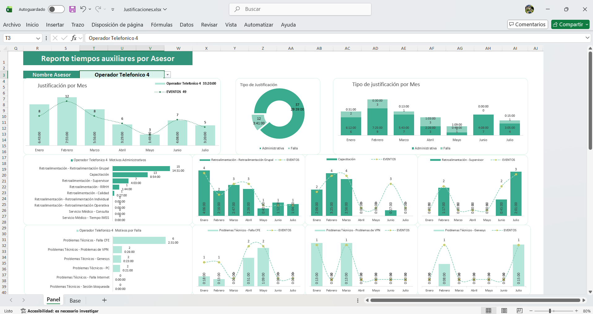

# Reportes-Seguimientos Kpi´s Excel

  

---

# 1 Justificaciones.xls 

Descripción: Muestra el detalle de tiempos autorizados a operadores (contact center) por auxiliares, se muestra Total General y detalle del Asesor seleccionado.

  
  
  

---

