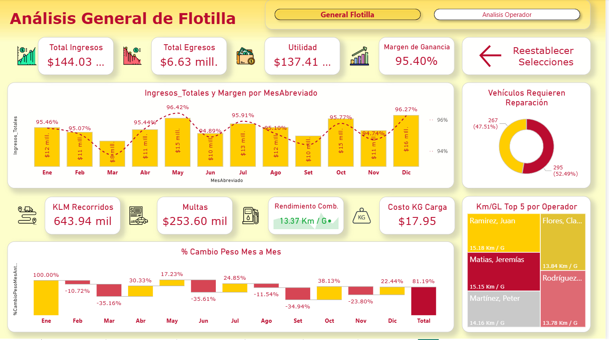

# Portafolio Proyectos Power Bi, Omar Castro (En Proceso)

## 01_Control de Flota
    Control de flota vehicular transportes de carga incluye:
    * Panorama General Beneficio Economico.
    * Analisis por operador.
    * Analisis de vehiculos.
    * Analisis rutas.

* 

