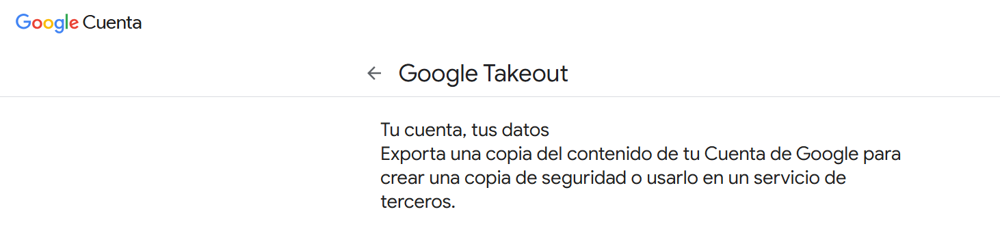
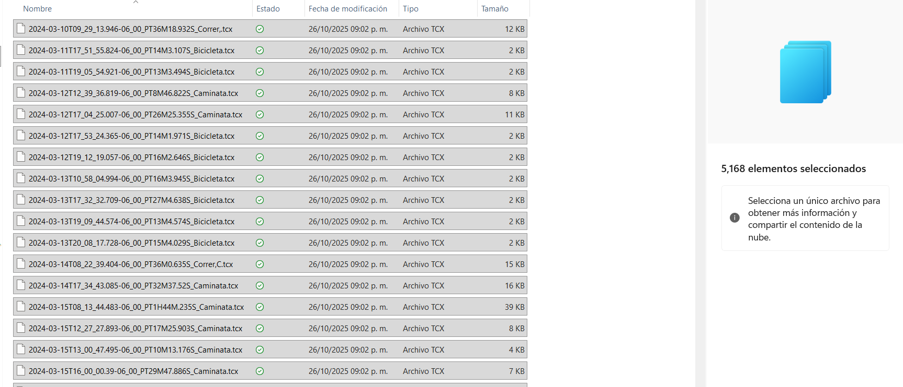
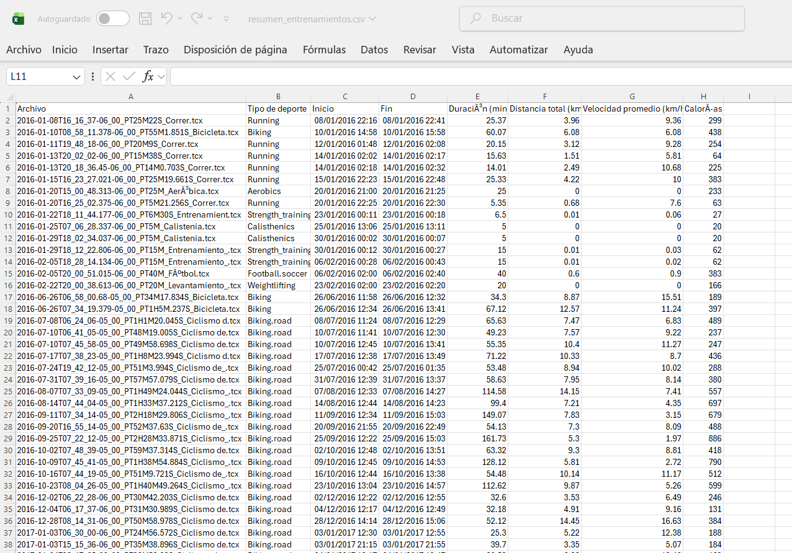
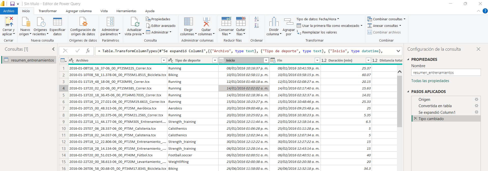
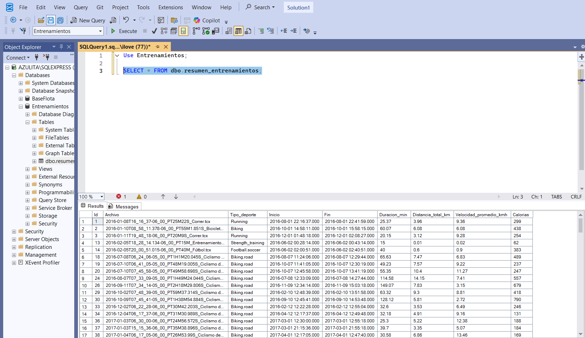

<!DOCTYPE html>
<html lang="es">
<head>
  <meta charset="UTF-8" />
  <meta name="viewport" content="width=device-width, initial-scale=1.0"/>
  <title>Análisis Google Fit</title>
  
</head>
<body>

  <h1>🏃‍♂️ Análisis de Actividades Físicas – Google Fit</h1>
  
<strong>Google Fit Activity Analysis – Google Takeout (.tcx)</strong>

  

  <h2>📌 Introducción | Introduction</h2>
  
Este proyecto extrae y analiza datos de actividad física desde archivos <code>.tcx</code> generados por servicios como Google Fit, Strava o Garmin, obtenidos mediante <a href="https://takeout.google.com/">Google Takeout</a>.

  
This project extracts and analyzes physical activity data from <code>.tcx</code> files generated by services like Google Fit, Strava, or Garmin, obtained via Google Takeout.

  <h2>🎯 Objetivo | Objective</h2>
  
Consolidar la información contenida en miles de archivos <code>.tcx</code> para generar una base estructurada en formatos <code>.csv</code>, <code>.json</code> y <code>.sql</code>, que permita realizar análisis detallados sobre hábitos de entrenamiento.

  
To consolidate data from thousands of <code>.tcx</code> files into structured formats for detailed analysis of training habits.

  
<em>Esta muestra representa una vista parcial; la base completa será utilizada en proyectos con Power BI y SQL Server.</em>

  <h2>📂 Datos fuente | Source Data</h2>
  
  <ul>
    <li><strong>Cantidad de archivos:</strong> 5,168</li>
    <li><strong>Rango temporal:</strong> 2016–2024</li>
    <li><strong>Formato:</strong> .tcx (Training Center XML)</li>
    <li><strong>Tipos de actividad:</strong> ciclismo, caminata, carrera, otros</li>
    <li><strong>Variables por archivo:</strong> fecha, distancia, velocidad promedio, calorías, duración, frecuencia cardíaca</li>
  </ul>

  <h2>📊 Visualizaciones | Visualizations</h2>
  
  
Distribución de calorías quemadas por tipo de actividad

  
  
Distancia total por año

  <h2>📁 Archivos generados | Generated Files</h2>
  <table>
    <thead>
      <tr>
        <th>Formato</th>
        <th>Descripción</th>
        <th>Uso previsto</th>
      </tr>
    </thead>
    <tbody>
      <tr>
        <td>.csv</td>
        <td>Datos tabulares por actividad</td>
        <td>Análisis exploratorio</td>
      </tr>
      <tr>
        <td>.json</td>
        <td>Estructura jerárquica</td>
        <td>Integración con APIs</td>
      </tr>
      <tr>
        <td>.sql</td>
        <td>Scripts para base de datos</td>
        <td>Carga en SQL Server</td>
      </tr>
    </tbody>
  </table>

  
  
  

  <h2>🚀 Aplicaciones futuras | Future Applications</h2>
  <ul>
    <li>Dashboards interactivos en Power BI</li>
    <li>Consultas optimizadas en SQL Server</li>
    <li>Análisis longitudinal de hábitos de entrenamiento</li>
    <li>Visualización de métricas clave por tipo de deporte</li>
  </ul>

</body>
</html>