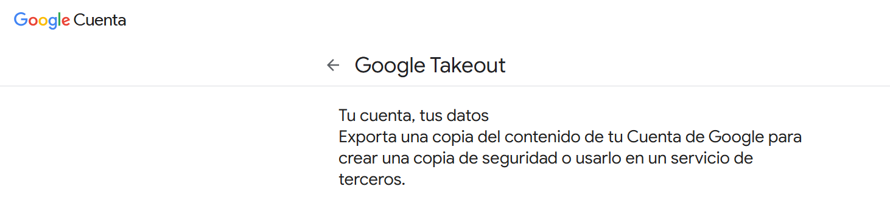
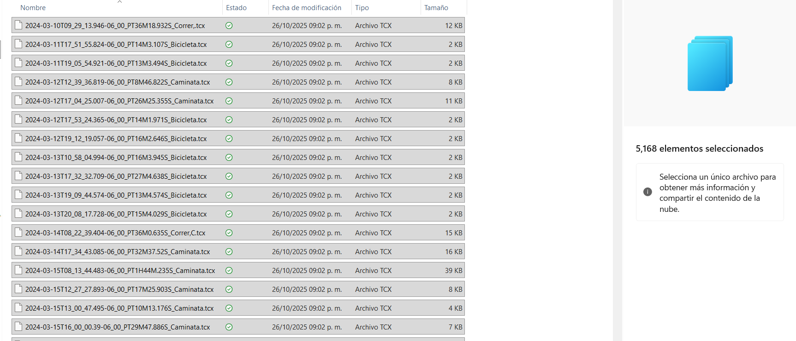

# Analisis Google Fit 

## Extracción de información de una base del servicio Google Takeout contenida en carpeta local, archivos .tcx (Training Center XML) utilizados para almacenar datos de actividad fisica en aplicaciones tipo: google Fit, Strava, Garmin, etc.

- Cantidad de archivos en carpeta: 5168 elementos que contienen historico de actividades desde 2016 hasta 2024-
- Cada archivo contiene detalles de una actividad como Tipo de deporte:
Biking, Walking, Biking.road, Running, y otras, ademas de información detallada de cada actividad: Fecha, Distancia, Vel Promedio, Calorías, etc.

## Objetivo: extraer y consolidar información de cada archivo (.csv, json, sql) para un realizar un analisis detallado sobre habitos de entrenamiento los cuales en esta vista seran solo una muestra, la base completa se usara en proyectos de Power Bi y SQL

   